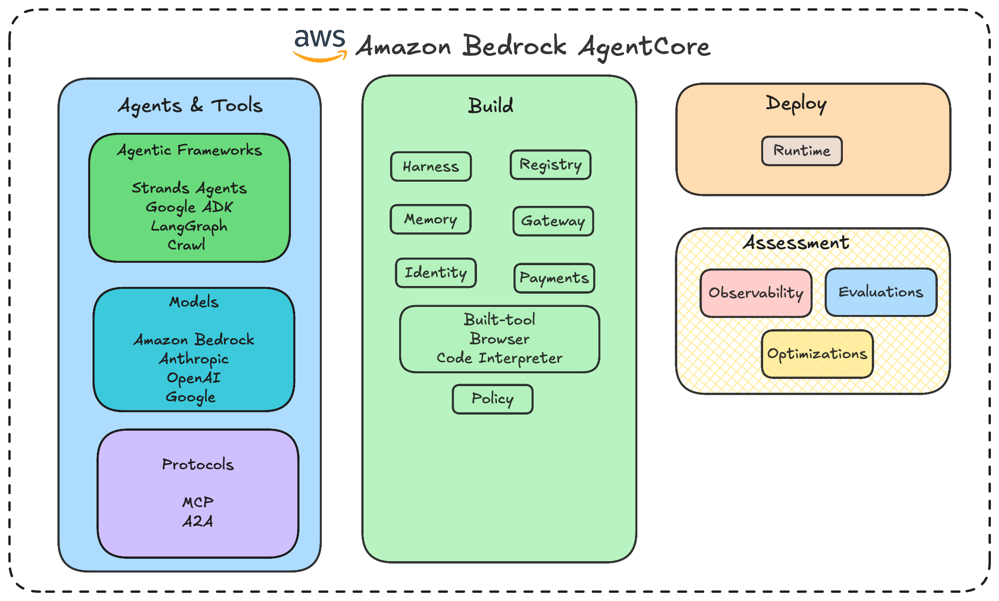
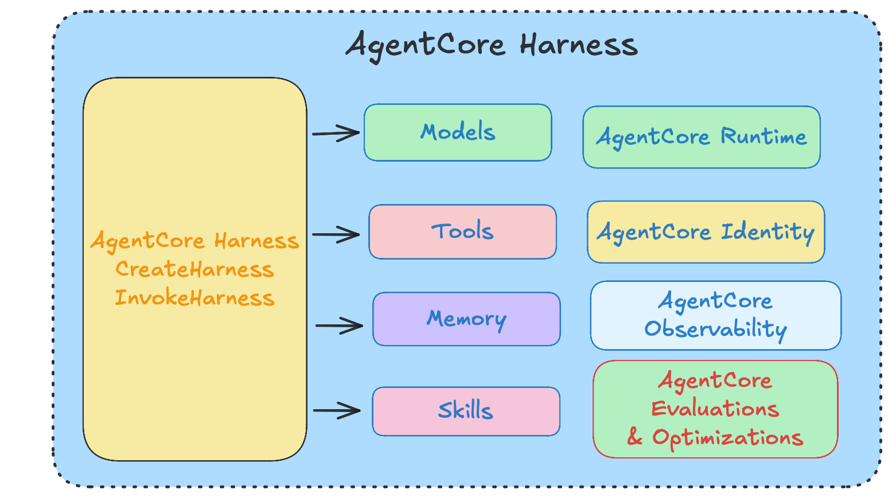

# Table of Contents

- [Introduction](#introduction)
- [What is Amazon Bedrock AgentCore?](#what-is-amazon-bedrock-agentcore)
- [Prerequisites and Configuration](#prerequisites-and-configuration)
- [AgentCore Primitives](#agentcore-primitives)
- [Selecting An Agent Framework: Strands Agents and Spring AI](#selecting-an-agent-framework-strands-agents-and-spring-ai)
- [Adding AgentCore Primitives to the Agent](#adding-agentcore-primitives-to-the-agent)
- [Deploying the Agent to AgentCore Runtime](#deploying-the-agent-to-agentcore-runtime)
- [End to End Testing](#end-to-end-testing)
- [Conclusion](#conclusion)

---

## Introduction

As an architect and developer, I often experience a sense of overwhelm when taking locally developed agents to production. This is because there are numerous infrastructure capabilities and architectural considerations that we need to envision, design, and evaluate—including various edge cases.

However, with the right platform and cloud provider, this complexity can be significantly reduced, allowing developers to focus primarily on business logic and agent capabilities while the platform takes care of the underlying infrastructure and operational requirements.

Given the plethora of cloud providers and platforms available today, in this article, we will explore Amazon Bedrock AgentCore, a set of capabilities offered within the AWS ecosystem that helps developers build, deploy, and operate AI agents in production.

We will explore the key AgentCore primitives, understand how to integrate them with an agent built using the Strands Agents framework, and finally deploy the agent to AgentCore Runtime.

> Amazon Bedrock AgentCore acts as a bridge between the developer and the complex infrastructure required to take AI agents from development to production.

---

## What is Amazon Bedrock AgentCore?

Amazon Bedrock AgentCore is an agentic platform designed for the development, deployment, and maintenance of highly effective AI agents securely at scale. It is framework-agnostic and model-agnostic, enabling users to utilize various agentic frameworks, models, and protocols tailored to their specific requirements. With AgentCore, we can construct Agents, Tools, and Model Context Protocol (MCP) Servers, as well as Agent Platforms.

AgentCore can be broadly categorized into the following components:

### 1. Agents and Tools
This is where you define the agent, the model it uses, and how it communicates with other agents and tools.

* **Agentic Frameworks**
  You can choose an agentic framework based on your requirements, such as:
  * Strands Agents
  * CrewAI
  * Google ADK
  * OpenAI
  * NVIDIA
  * Other supported agentic frameworks

* **Models**
  You can choose models from different model providers, depending on the framework and integration, such as:
  * Amazon Bedrock models
  * Anthropic
  * OpenAI
  * Other supported model providers

* **Protocols**
  Based on your use case, you can use popular protocols for agent and tool communication, such as:
  * **MCP** (Model Context Protocol)
  * **A2A** (Agent2Agent)

### 2. Build Components
AgentCore offers several building blocks that facilitate the construction and enhancement of production-ready AI agents.

* **Registry:** Centralized platform for registering and discovering agents, tools, and capabilities.
* **Harness:** Facilitates the development, testing, and interaction with agents.
* **Memory:** Provides memory capabilities enabling agents to maintain context and retain information.
* **Gateway:** Facilitates connectivity between agents and external tools, APIs, services, and MCP servers.
* **Identity:** Provides identity, authentication, and authorization capabilities for agents.
* **Built-in Tool: Browser:** Enables agents to interact with and retrieve information from the web.
* **Built-in Tool: Code Interpreter:** Enables agents to execute code for computational and data-processing tasks.
* **Payments:** Provides capabilities for incorporating payment-related interactions into agent workflows.
* **Policy:** Provides governance and controls for managing agent behavior and interactions.

### 3. Deploy Component
Once the agent has been built, it needs to be deployed and executed.

* **Runtime:** AgentCore Runtime provides a managed runtime environment for deploying and running AI agents securely at scale. It allows agents built using different frameworks to run within the AgentCore environment while integrating with other AgentCore capabilities such as Memory, Gateway, Identity, and Observability.

### 4. Assessment
After deploying an agent, it is important to understand how the agent is performing and whether it is meeting the expected objectives.

* **Observability:** Provides visibility into the agent's behavior and execution, including:
  * Logs
  * Metrics
  * Traces
  * Agent interactions
  * Tool calls
  * Model calls
  * Errors and latency

* **Evaluations:** Helps determine the quality and effectiveness of an agent by evaluating aspects such as:
  * Accuracy
  * Relevance
  * Task completion
  * Response quality
  * Tool usage
  * Agent trajectories

* **Optimization:** Uses the insights obtained from observability and evaluations to improve the agent's performance, efficiency, and reliability.

### 5. Refinement
The final stage is continuous refinement of the agent.

Based on the results from Observability, Evaluations, and Optimization, you can identify areas for improvement and refine the agent's:
* Instructions and prompts
* Model selection
* Tool usage
* Memory
* Policies
* Agent workflow
* Overall performance

#### Overall AgentCore Lifecycle

Agents & Tools ➔ Build ➔ Deploy ➔ Assess ➔ Refine

This approach enables organizations to build AI agents using their preferred frameworks, models, and protocols, while leveraging AgentCore capabilities to deploy, secure, operate, observe, evaluate, and continuously improve those agents at scale.

---

## Prerequisites and Configuration

* An AWS account with configured credentials
* Node.js 20 or higher
* Python 3.10+
* IAM permissions
* Model access
* Docker *(optional, mandatory only if you choose the container build type)*

We can build agents using the following approaches:
1. **Python-based** (using the `bedrock-starter-kit`)
2. **Node-based** (using the `agentcore` CLI, recommended)

---

## AgentCore Primitives

### AgentCore Harness

As a developer, navigating the vast array of tools and services available can be a daunting task when building an infrastructure tailored to the requirements of Agentic AI. AgentCore Harness emerges as a robust solution for this purpose.

Harness operates at an abstract level of configuration, providing a streamlined approach to creating agents compared to conventional methods. 

AWS had already shipped the underlying components of AgentCore primitives, encompassing:
* Runtime
* Memory Management
* Gateway Integration
* Browser Support
* Code Interpreter
* Identity Management
* Observability

AgentCore Harness interfaces with two primary APIs and encapsulates the underlying components previously mentioned:

* `CreateHarness`: This API facilitates the definition of an agent.
* `InvokeHarness`: This API enables the execution of the defined agent.

You define the model, system prompt, tools, skills, memory, and limitations. AgentCore then executes the loop, utilizing the Strands Agents framework. Modifying a tool or altering the model constitutes an edit to the configuration, not a redeployment. Internally, the agent operates within a confined sandbox on AgentCore Runtime, enabling it to access files and execute code without requiring manual compilation. Each session utilizes its own Lambda MicroVM, which maintains an isolated state or filesystem and provides access to the code within the sandbox. The complete transaction is streamed and automatically pushed to Amazon CloudWatch. The majority of the agent’s logs, metrics, and traces are now accessible under the **Generative AI Observability** section.
